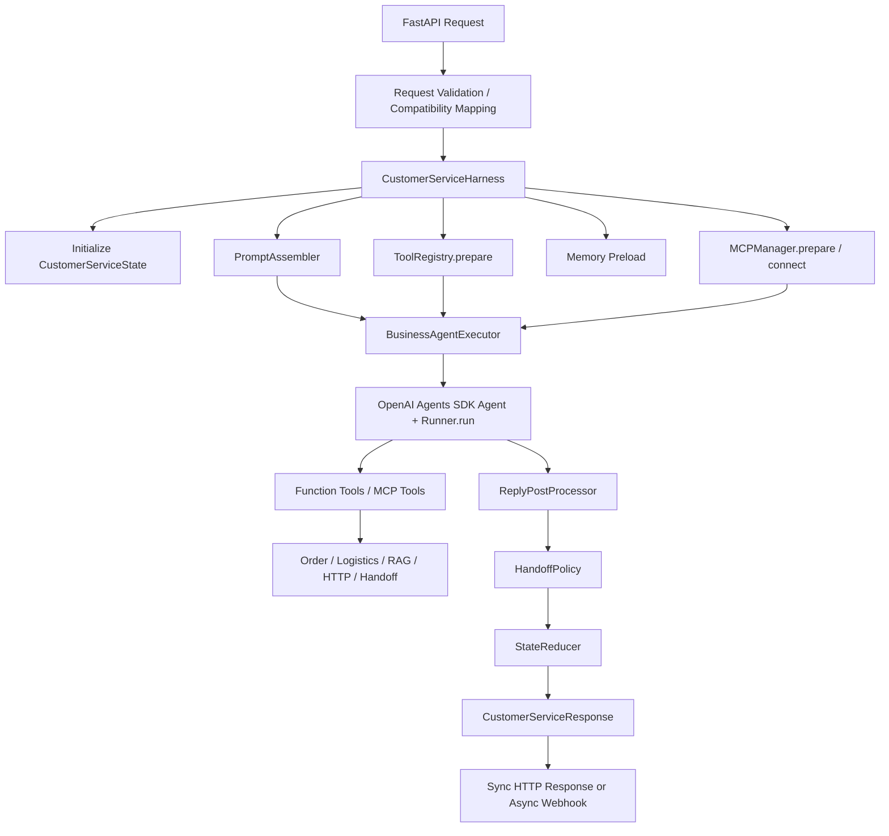

# Intelligent Customer Service Session Handoff

> 更新时间：2026-06-25  
> 项目目录：`/Users/tanglin/VibeCoding/intelligent-customer-service/openaiagents-intelligent-customer-service`  
> GitHub：`https://github.com/fanly93/openaiagents-intelligent-customer-service`  
> 当前开发分支：`feature/customer-service-agent-demo`  
> 当前阶段：Phase 6 Stage 1 已完成，下一步从 Stage 2 开始

## 1. 新会话快速接入

新会话不需要重新探索整个项目。按以下顺序执行：

```bash
cd /Users/tanglin/VibeCoding/intelligent-customer-service/openaiagents-intelligent-customer-service

git status --short --branch
git branch -vv

sed -n '1,260p' SESSION_HANDOFF.md
sed -n '1,220p' AGENTS.md
sed -n '450,990p' \
  docs/superpowers/plans/2026-06-20-phase6-live-model-and-e2e-validation-implementation-plan.md
```

然后运行当前基线：

```bash
ALLOWED_MODELS='gpt-4.1-mini,gpt-4.1,deepseek-v4-flash,qwen3.7-plus' \
  .venv/bin/python -m pytest -q
```

预期基线：

```text
178 passed
```

接下来按照 Superpowers 流程执行：

```text
Phase 6 Stage 2: Agents SDK Model Adapter Integration
```

Stage 2 存在明确前后依赖，并会共同修改 Provider、Executor、Harness 和
测试文件，不适合为了并行而同时派发多个实现 Agent。推荐使用
`subagent-driven-development` 串行执行 Task 2.1、2.2、2.3，并对每个任务
进行规范符合性审查和代码质量审查。

## 2. 项目目的与初衷

本项目面向中国品牌出海业务。海外客户服务通常同时承受以下压力：

- 多语言、多时区和多渠道咨询。
- 人工客服难以稳定提供 7×24 小时服务。
- 传统规则机器人只能处理简单 FAQ。
- 导购、订单、物流、退换货、产品使用和故障排障仍高度依赖人工。
- 订单、物流、售后等结构化业务数据与 FAQ、产品手册、故障文档等
  非结构化知识彼此割裂。
- 不同商家拥有不同产品、政策、知识库、业务接口和品牌话术，不能通过
  在代码中硬编码商家逻辑来扩展。

项目目标是构建一个接近生产形态、可以逐步替换 Mock Provider 并演进为
生产系统的智能客服 Agent 后端。

## 3. 目标用户

主要目标用户：

- 面向海外市场的中国品牌和跨境电商商家。
- 需要接入订单、物流、售后和产品知识的企业客服团队。
- 负责审核复杂案例和高风险投诉的人工客服。
- 负责配置商家工具、知识范围、模型和策略的运营或平台团队。
- 维护 Agent、业务工具和企业集成的后端研发团队。

最终服务对象是海外消费者，但本仓库实现的是 Agent 后端和企业集成能力，
不是面向消费者的前端产品。

## 4. 当前批准的架构边界

当前批准架构以以下文档为准：

- `docs/superpowers/specs/2026-06-17-openai-agents-customer-service-design.md`
- `docs/superpowers/specs/2026-06-20-phase6-live-model-and-e2e-validation-design.md`
- `docs/superpowers/plans/2026-06-17-openai-agents-customer-service-demo-implementation-plan.md`
- `docs/superpowers/plans/2026-06-20-phase6-live-model-and-e2e-validation-implementation-plan.md`

必须遵守的当前边界：

- 使用 `tenant_id` 作为当前版本租户标识。
- 使用一个 OpenAI Agents SDK Customer Service Agent。
- 使用轻量 `CustomerServiceHarness` 管理 Agent 生命周期。
- 使用请求级工具、MCP、知识、记忆、模型和指令配置。
- Mock 数据必须位于可替换 Provider 边界之后。
- 第一版允许工具通过 Agents SDK Context 更新共享状态。
- `StateReducer` 负责最终响应一致性和快照脱敏。
- 未经新 spec 明确批准，不要引入 Router、TaskPlanner、Lazy Skill 或
  Specialist Agents。
- 父目录中的多 Agent 架构笔记是未来探索方向，不能覆盖当前已批准 spec。

## 5. 整体运行链路



当前 Phase 6 要在 `BusinessAgentExecutor` 前增加 Provider-neutral 模型适配：

```text
MODEL_PROVIDER
  -> ProviderConfigResolver
  -> AsyncOpenAI(api_key, base_url)
  -> OpenAIChatCompletionsModel
  -> Agent(model=model_adapter)
  -> Runner.run()
```

Harness、工具和业务逻辑不得根据 OpenAI、DeepSeek 或 DashScope 写分支。

## 6. 核心模块职责

### `app/api/`

- FastAPI 路由。
- `/customer-service/respond` 主接口。
- `/emailv4` 旧邮件请求兼容接口。
- 同步响应、异步 BackgroundTasks 和 webhook 回调。
- Webhook URL allowlist、HTTPS 和 DNS 安全检查。

### `app/harness/`

- `customer_service_harness.py`：主生命周期编排。
- `business_agent_executor.py`：创建 Agent 并调用 `Runner.run()`。
- `prompt_assembler.py`：组合状态、记忆、知识、工具和租户指令。
- `reply_post_processor.py`：清理 THINK、ACTION、OBSERVE 等痕迹。
- `handoff_policy.py`：人工请求、高风险投诉和空回复兜底。
- `state_reducer.py`：生成响应、脱敏状态快照。

### `app/state/`

- API 请求、会话状态和响应模型。
- 核心状态包含：
  - `tenant_id`
  - `contexts`
  - `collected_slots`
  - `missing_required_slots`
  - `retrieved_knowledge`
  - `user_memories`
  - `order_result`
  - `logistics_result`
  - `http_tool_results`
  - `mcp_tool_results`
  - `tool_call_history`
  - `need_handoff_to_human`
  - `handoff_type`
  - `handoff_reason`
  - `token_usage`
  - `performance_stats`
  - `events`

### `app/tools/`

- `registry.py`：请求级工具注册和可信 HTTP 工具绑定。
- `core_tools.py`：配置驱动的槽位抽取。
- `dynamic_http_tools.py`：
  - 参数 Schema
  - 必填和类型校验
  - 响应映射
  - 超时、重试和缓存
  - 敏感字段脱敏
  - allowlist、DNS pinning 和 SSRF 防护
- `mcp_manager.py`：
  - stdio、SSE、streamable HTTP
  - 租户级可信 Server Registry
  - 工具 allowlist/blocklist
  - 描述和参数描述覆盖
  - 生命周期管理

### `app/retrieval/`

- 租户隔离的 Mock RAG。
- 支持 `kbId`、`fileIds`、`top_k` 和 `threshold`。
- Mock 长期记忆预检索。
- 设计为后续替换真实向量库、混合检索和记忆服务。

### `app/providers/`

- Phase 6 Stage 1 新增。
- `openai_compatible.py` 已实现：
  - OpenAI、DeepSeek、DashScope Provider 配置解析。
  - 必填字段校验。
  - Base URL 校验。
  - 安全错误类型。
  - 超时和重试类型规范化。
- 尚未实现 `AsyncOpenAI` 和 `OpenAIChatCompletionsModel` 工厂。

### `app/observability/`

- 本地结构化 Trace。
- OpenAI Agents SDK 生命周期 Hooks。
- Agent 和 Tool 开始/结束事件。
- 性能统计。
- 可选 Langfuse v2 集成。

## 7. 项目结构

```text
openaiagents-intelligent-customer-service/
├── .env                         # 本地密钥，Git 忽略
├── .env.example                 # 安全配置模板
├── .venv/                       # 本地虚拟环境，Git 忽略
├── AGENTS.md                    # 项目级开发规范
├── README.md                    # 使用说明
├── SESSION_HANDOFF.md           # 新会话任务交接入口
├── pyproject.toml
├── app/
│   ├── api/
│   ├── harness/
│   ├── observability/
│   ├── providers/
│   ├── retrieval/
│   ├── state/
│   └── tools/
├── data/
│   ├── knowledge/
│   ├── mock_orders.json
│   ├── mock_logistics.json
│   ├── mock_memories.json
│   └── reply_templates.json
├── docs/superpowers/
│   ├── specs/
│   └── plans/
├── findings/
├── mcp_servers/
├── scripts/
└── tests/
```

## 8. 技术栈

- Python 3.11+，当前本地开发环境 Python 3.13.12。
- FastAPI。
- Pydantic v2 和 pydantic-settings。
- OpenAI Agents SDK：
  - `Agent`
  - `Runner.run()`
  - Function Tools
  - Run Hooks
  - MCP Servers
- `openai-agents>=0.17.5,<0.18.0`。
- OpenAI Python SDK 的 `AsyncOpenAI`。
- MCP Python SDK。
- HTTPX 和 HTTP Core。
- pytest、pytest-asyncio、respx。
- Uvicorn。
- 可选 Langfuse v2。
- JSON Mock 数据。

所有 Python 命令必须使用项目虚拟环境：

```bash
.venv/bin/python
.venv/bin/python -m pytest
.venv/bin/python -m pip
```

不要使用系统 Python、用户 Python 或 Miniconda base 环境安装依赖。

## 9. 当前支持的业务场景

- 普通 FAQ。
- 退换货政策。
- 商品推荐。
- 订单查询。
- 物流查询。
- 售后协同。
- 产品使用咨询。
- 电子产品故障排障。
- 宠物产品建议。
- 假发产品推荐。
- 多语言邮件回复。
- 客户主动请求转人工。
- 高风险投诉不自动回复并转人工。
- MCP 产品手册查询。
- 动态 HTTP 售后接口调用。

`scripts/run_demo_cases.py` 包含 10 个离线场景，使用确定性 Fake Runner，
不会调用真实模型或外部网络。

## 10. 安全边界

- `.env` 和 `.venv` 必须保持 Git ignored。
- 不得读取、打印、复制或提交真实 API Key。
- 请求不能提交任意动态 HTTP URL、Headers 或凭据。
- 请求只能选择部署侧注册的可信 HTTP 工具名称。
- 请求不能提交任意 MCP 命令、URL、环境变量或凭据。
- MCP 和 HTTP 工具按 `tenant_id` 隔离。
- Webhook 和动态 HTTP 使用 allowlist。
- 生产环境要求 HTTPS。
- 外部错误只返回统一安全消息。
- State Snapshot 对 token、authorization、email 等字段脱敏。
- 请求级模型必须通过 `ALLOWED_MODELS`。

## 11. 配置状态

本地 `.env` 已创建并填入三家厂商配置，但不得在文档、日志或提交中写出
密钥。

当前非敏感配置：

```text
MODEL_PROVIDER=openai
RUN_LIVE_MODEL_TESTS=0
OPENAI_MODEL=gpt-4.1
DEEPSEEK_MODEL=deepseek-v4-flash
DASHSCOPE_MODEL=qwen3.7-plus
ALLOWED_MODELS=gpt-4.1,deepseek-v4-flash,qwen3.7-plus
```

2026-06-20 的直接 OpenAI-compatible API 验证结果：

- DeepSeek：HTTP 200，返回 `pong`。
- DashScope：HTTP 200，返回 `pong`。
- OpenAI：官方接口返回 HTTP 403
  `unsupported_country_region_territory`，属于区域限制，未能完成生成验证。

以上结果是历史验证记录。新会话在真正运行 Live 测试前，应根据当前网络、
额度和账号状态重新验证，且不得输出 API Key。

## 12. 已完成进度

### Phase 1：项目骨架和状态模型

已完成：

- Python 项目与 `.venv`。
- FastAPI 骨架。
- 请求、状态和响应模型。
- `/emailv4` 兼容映射。
- 基础安全约束。

### Phase 2：Single-Agent Harness

已完成：

- `CustomerServiceHarness`。
- `BusinessAgentExecutor`。
- `Agent + Runner.run()` 主路径。
- Prompt、后处理、StateReducer。
- 可注入 Fake Runner 的测试边界。

### Phase 3：工具、RAG 和 MCP

已完成：

- 配置驱动槽位抽取。
- RAG 的 `kbId`、`fileIds` 过滤。
- Mock 订单和物流工具。
- Dynamic HTTP Tool。
- MCP Manager 和本地产品支持 Server。
- 租户级可信工具绑定。

### Phase 4：转人工、记忆、API 和观测

已完成：

- Mock 长期记忆。
- 转人工策略。
- 同步和异步 API。
- Webhook。
- Local Trace、Run Hooks 和可选 Langfuse。

### Phase 5：安全、演示和验收收尾

已完成：

- 请求和出站安全边界。
- 租户隔离。
- SSRF 防护。
- 10 个离线 Demo。
- Mock Business API Server。
- README 和项目规范。

### Phase 6 Stage 1：Provider Configuration Contract

已完成：

- `.env` 和 `.env.example`。
- OpenAI、DeepSeek、DashScope Settings。
- `ProviderConfig`。
- `ProviderConfigurationError`。
- `resolve_provider_config`。
- 缺字段、未知 Provider、畸形 URL 和数值类型测试。
- 规范符合性和代码质量审查。

相关提交：

```text
31f4593 feat: add openai-compatible provider configuration
c259f0a docs: mark phase 6 stage 1 complete
```

## 13. 当前停点

当前准确停在：

```text
Phase 6 Stage 2
Task 2.1 尚未开始
```

不要重复实现 Stage 1，也不要直接跳到 Live 测试。

当前 `BusinessAgentExecutor` 仍使用字符串模型：

```python
model=model or settings.default_model
```

因此虽然 `.env` 已包含三家 Provider 配置，主 Agent 运行路径还没有使用：

- Provider Resolver。
- Provider-specific `AsyncOpenAI` Client。
- `OpenAIChatCompletionsModel` Adapter。

## 14. 下一步任务：Phase 6 Stage 2

权威任务细节位于：

`docs/superpowers/plans/2026-06-20-phase6-live-model-and-e2e-validation-implementation-plan.md`

### Task 2.1：OpenAI-Compatible Model Factory

目标：

- 在 `app/providers/openai_compatible.py` 增加
  `OpenAICompatibleModelFactory`。
- 根据 `MODEL_PROVIDER` 创建：

```text
AsyncOpenAI(api_key, base_url, timeout, max_retries)
OpenAIChatCompletionsModel(model, openai_client)
```

- 请求级模型只能在 allowlist 内覆盖。
- 当前 Provider 默认模型必须自动进入允许集合。
- 非 OpenAI Provider 不得把第三方 Key 用于 OpenAI 云端 tracing。

必须先写失败测试，再实现。

### Task 2.2：接入 BusinessAgentExecutor

目标：

- 向 `BusinessAgentExecutor` 注入 Model Factory。
- Fake Runner 路径保持兼容。
- 真实 SDK 路径使用 Model Adapter，不再直接使用字符串模型。
- `CustomerServiceHarness` 的模型校验改为 Provider-aware。
- 保持 Token Usage 聚合。

### Task 2.3：Provider 错误归一化

目标：

- 分类认证失败、限流、超时、协议错误和未知 Provider 错误。
- 不把上游错误正文和 Key 暴露给客户。
- Trace 仅记录：
  - provider
  - error code
  - HTTP status
  - provider request id
- API 继续返回：

```text
Customer service processing failed.
```

### Stage 2 执行约束

- Task 2.1、2.2、2.3 存在顺序依赖。
- 多个任务修改相同 Provider 和测试文件。
- 不要并行派发实现 Agent。
- 可以按 Task 串行使用不同 Subagent。
- 每个 Task 需要：
  1. TDD RED。
  2. 最小实现。
  3. GREEN。
  4. Spec Review。
  5. Code Quality Review。
- Stage 2 完成后必须停止并向用户汇报，不要自动进入 Stage 3。

## 15. Phase 6 后续任务

### Stage 3：Deterministic Full-Chain Offline E2E

计划新增：

- `tests/e2e/conftest.py`
- `tests/e2e/test_customer_service_e2e.py`
- `e2e` pytest marker

覆盖真实 FastAPI、Harness、工具、MCP、后处理、转人工和 StateReducer，
只替换不确定性的模型边界。

### Stage 4：Opt-In Live Model Validation

计划新增：

- `live_model` pytest marker。
- `RUN_LIVE_MODEL_TESTS=1` 显式开关。
- 真实模型连通性测试。
- 真实模型选择订单、物流、RAG、转人工工具。
- 本地 MCP 和本地 Mock HTTP 工具测试。

默认 pytest 必须跳过所有真实模型请求，避免误计费。

### Stage 5：Documentation and Final Verification

计划完成：

- README 多 Provider 使用说明。
- AGENTS.md Phase 6 规则。
- 完整安全扫描。
- Offline E2E 验证。
- Live Test 默认跳过验证。
- 可选的当前 Provider Live 验收。
- Phase 6 最终状态更新和分支收尾。

## 16. 项目最终形态

当前 Demo 完成后的目标形态：

- 一个接近生产型的智能客服 Agent 后端。
- 一个轻量 Single-Agent Harness，而不是巨型工作流图。
- 统一 OpenAI-compatible Provider 边界。
- 商家/租户级工具、知识、记忆和策略配置。
- 订单、物流、售后、RAG 和 MCP 可替换 Provider。
- 同步 API 和可回调异步 API。
- 可追踪、可回放、可评估的运行链路。
- 明确的自动回复、回复后转人工和不回复直接转人工策略。
- 默认离线可测试，真实模型测试显式启用。

生产级演进方向：

1. 将 JSON Mock 数据替换为企业订单、物流、售后和客户系统。
2. 将 Mock RAG 替换为向量检索或混合检索。
3. 将 Mock Memory 替换为长期记忆服务。
4. 将部署代码中的工具和 MCP Registry 替换为安全配置中心。
5. 将 FastAPI BackgroundTasks 替换为持久消息队列和任务系统。
6. 为 Webhook 增加持久重试、幂等和死信机制。
7. 将 Langfuse v2 迁移到 OpenTelemetry-native 版本。
8. 建立离线数据集、Trace Replay、回归评估和 Provider 对比基线。
9. 在新 spec 批准后，再评估 Router、TaskPlanner 和 Specialist Agents。

## 17. 当前限制和已知风险

- 当前是 Single-Agent，不是多 Agent Router 架构。
- RAG 是关键词重叠 Mock，不是 Embedding 或 Hybrid Retrieval。
- Memory、订单、物流和模板仍是本地 JSON。
- Async 模式使用进程内 BackgroundTasks，不耐重启。
- Webhook 没有持久重试队列。
- Dynamic HTTP 和 MCP 可信定义仍注册在应用代码中。
- README 尚未更新 Phase 6 多 Provider 使用方式，计划在 Stage 5 更新。
- 当前 `.env` 的 `ALLOWED_MODELS` 不包含旧测试模型
  `gpt-4.1-mini`，直接运行全量测试可能出现一个模型白名单失败。
- 在 Stage 2 完成前，主执行器不能真正根据 `MODEL_PROVIDER` 切换厂商。

## 18. 测试与验证说明

Phase 6 Stage 1 完成时验证结果：

```text
Provider tests: 14 passed
Stage 1 focused regression: 27 passed
Full suite with temporary ALLOWED_MODELS override: 178 passed
```

当前推荐全量命令：

```bash
ALLOWED_MODELS='gpt-4.1-mini,gpt-4.1,deepseek-v4-flash,qwen3.7-plus' \
  .venv/bin/python -m pytest -q
```

`RUN_LIVE_MODEL_TESTS` 当前必须保持 `0`，直到 Stage 4 测试完成。

## 19. Git 状态与远端

远端：

```text
origin https://github.com/fanly93/openaiagents-intelligent-customer-service.git
```

当前分支：

```text
feature/customer-service-agent-demo
```

在生成本交接文档前：

```text
main                                -> c259f0a
feature/customer-service-agent-demo -> c259f0a
origin/main                         -> c259f0a
origin/feature/customer-service-agent-demo -> c259f0a
```

提交本文件后，当前功能分支和远端 `main` 应更新到新的 handoff commit。

`.env`、`.venv`、缓存和 `*.pyc` 不得进入 Git。

## 20. 重要参考

原始单 Agent 邮件项目：

`/Users/tanglin/VibeCoding/intelligent-customer-service/lmas-email-agent/core/single_react_agent_1118.py`

已沉淀的迁移发现：

`findings/single_react_agent_1118_source_findings.md`

需要查看原始实现细节、异常分支和完整参数时，应回到上述源文件细读。

## 21. 新会话开始执行时的建议提示词

可以直接向新会话发送：

```text
请先完整阅读项目根目录 SESSION_HANDOFF.md 和 AGENTS.md。
当前不要重新做全项目探索，也不要修改已完成的 Phase 1-6 Stage 1。
按照 docs/superpowers/plans/
2026-06-20-phase6-live-model-and-e2e-validation-implementation-plan.md，
使用 Superpowers 的 subagent-driven-development 和 TDD，
从 Phase 6 Stage 2 Task 2.1 开始。

先检查任务依赖和共享文件。Stage 2 任务存在顺序依赖，不要为了并行而并行。
每个 Task 完成后执行 spec review 和 code quality review。
Stage 2 全部完成、测试通过、计划状态同步并提交后停止，向我汇报，不要继续 Stage 3。
```

